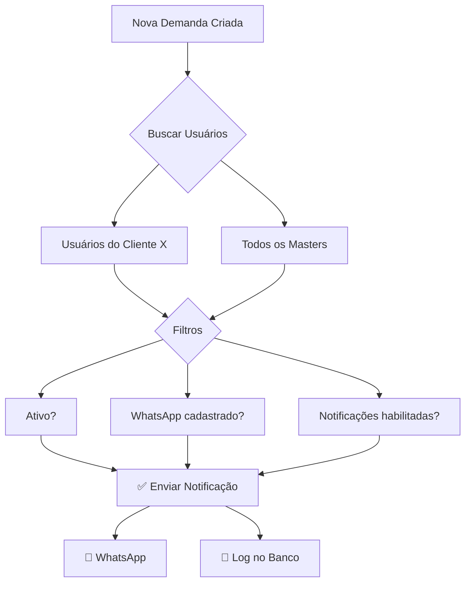

# 📱 Sistema de Notificações WhatsApp - DeBrief

<div align="center">


**Sistema completo de notificações individuais via WhatsApp com segmentação inteligente por cliente**

[📚 Documentação Completa](#-documentação) • [🚀 Início Rápido](#-início-rápido) • [🧪 Testar](#-como-testar) • [🆘 Suporte](#-troubleshooting)

</div>

---

## ✨ Características

<table>
<tr>
<td width="50%">

### 🎯 Notificações Inteligentes
- ✅ Mensagens individuais (pessoa a pessoa)
- ✅ Segmentação automática por cliente
- ✅ Masters recebem TODAS as notificações
- ✅ Usuários comuns recebem apenas do seu cliente

</td>
<td width="50%">

### 🔔 Eventos Notificados
- ✅ Nova demanda criada
- ✅ Demanda atualizada
- ✅ Status alterado
- ✅ Em desenvolvimento
- ✅ Concluída
- ✅ Excluída

</td>
</tr>
<tr>
<td width="50%">

### 👤 Controle do Usuário
- ✅ Cadastrar número WhatsApp
- ✅ Habilitar/desabilitar notificações
- ✅ API REST completa
- ✅ Configuração via perfil

</td>
<td width="50%">

### 📊 Monitoramento
- ✅ Logs completos de envio
- ✅ Estatísticas de sucesso
- ✅ Auditoria de notificações
- ✅ Troubleshooting facilitado

</td>
</tr>
</table>

---

## 🚀 Início Rápido

### 1️⃣ Configurar WhatsApp (1 minuto)

```bash
# Conectar ao banco
./conectar-banco-correto.sh

# Configurar seu número (substituir valores)
```

```sql
UPDATE users 
SET 
    whatsapp = '5585991042626',  -- SEU NÚMERO AQUI
    receber_notificacoes = true
WHERE email = 'seu.email@example.com';  -- SEU EMAIL AQUI
```

### 2️⃣ Testar (2 minutos)

```bash
# Script de teste completo
./testar-notificacoes.sh
```

**OU**

1. Acessar http://debrief.interce.com.br
2. Criar uma nova demanda
3. Verificar WhatsApp 📱

### 3️⃣ Pronto! ✅

Você receberá notificações automaticamente em todos os eventos!

---

## 📋 Exemplo de Notificação

```
🔔 Nova Demanda Criada!

📋 Demanda: Implementar portal do cidadão
🏢 Cliente: Prefeitura de Russas
🏛️ Secretaria: Secretaria de Tecnologia
📌 Tipo: Sistema Web
🟡 Prioridade: Média
📅 Prazo: 31/12/2024

👤 Solicitante: João Silva

🔗 Ver no Sistema: https://trello.com/c/ABC123

_ID: 550e8400-e29b-41d4-a716-446655440000_
```

---

## 🎯 Como Funciona

### Segmentação Automática



### Exemplo Prático

**Cenário:**
- 3 usuários cadastrados:
  - 👤 João (cliente: Russas)
  - 👤 Maria (cliente: Quixadá)
  - 👤 Admin (master)

**Demanda criada para "Russas":**
- ✅ João recebe (mesmo cliente)
- ❌ Maria NÃO recebe (cliente diferente)
- ✅ Admin recebe (é master)

---

## 📡 API Endpoints

### Obter Perfil Atual

```http
GET /api/usuarios/me
Authorization: Bearer {token}
```

**Resposta:**
```json
{
  "id": "uuid",
  "username": "joao.silva",
  "email": "joao@example.com",
  "nome_completo": "João Silva",
  "tipo": "cliente",
  "cliente_id": "cliente-uuid",
  "whatsapp": "5585991042626",
  "receber_notificacoes": true
}
```

### Atualizar Configurações de Notificação

```http
PUT /api/usuarios/me/notificacoes
Authorization: Bearer {token}
Content-Type: application/json

{
  "whatsapp": "5585991042626",
  "receber_notificacoes": true
}
```

---

## 🧪 Como Testar

### Opção 1: Script Automatizado ⭐ (Recomendado)

```bash
./testar-notificacoes.sh
```

**O que faz:**
- ✅ Verifica configurações
- ✅ Configura WhatsApp
- ✅ Cria demanda de teste
- ✅ Verifica logs
- ✅ Mostra estatísticas

**Tempo:** ~2 minutos

### Opção 2: Teste Manual

1. **Configurar WhatsApp** (ver seção [Início Rápido](#-início-rápido))
2. **Criar demanda** via interface web
3. **Verificar WhatsApp** 📱

### Opção 3: API Direta

```bash
# 1. Login
TOKEN=$(curl -s -X POST http://localhost:8000/api/auth/login \
  -H "Content-Type: application/json" \
  -d '{"username": "seu.email@example.com", "password": "sua-senha"}' \
  | jq -r '.access_token')

# 2. Configurar WhatsApp
curl -X PUT http://localhost:8000/api/usuarios/me/notificacoes \
  -H "Authorization: Bearer $TOKEN" \
  -H "Content-Type: application/json" \
  -d '{"whatsapp": "5585991042626", "receber_notificacoes": true}'

# 3. Criar demanda via interface web
# 4. Verificar WhatsApp
```

---

## 📊 Monitoramento

### Verificar Últimas Notificações

```sql
SELECT 
    nl.created_at,
    nl.status,
    d.nome as demanda,
    c.nome as cliente,
    nl.dados_enviados->>'usuario_nome' as usuario,
    nl.dados_enviados->>'whatsapp' as whatsapp
FROM notification_logs nl
JOIN demandas d ON d.id = nl.demanda_id
JOIN clientes c ON c.id = d.cliente_id
WHERE nl.tipo = 'whatsapp'
ORDER BY nl.created_at DESC
LIMIT 20;
```

### Estatísticas de Sucesso

```sql
SELECT 
    status,
    COUNT(*) as total,
    ROUND(COUNT(*)::numeric / SUM(COUNT(*)) OVER () * 100, 2) as percentual
FROM notification_logs
WHERE tipo = 'whatsapp'
GROUP BY status;
```

### Logs do Backend

```bash
# Logs em tempo real
docker logs -f debrief-backend | grep -i "notific"

# Últimos erros
docker logs debrief-backend --tail 100 | grep -i "error"
```

---

## 🛠️ Arquitetura

### Componentes

```
┌─────────────────────────────────────────────────────────────┐
│                     SISTEMA DE NOTIFICAÇÕES                  │
└─────────────────────────────────────────────────────────────┘

┌──────────────┐    ┌──────────────┐    ┌──────────────┐
│   FRONTEND   │───▶│   BACKEND    │───▶│  EVOLUTION   │
│     Web      │    │    API       │    │     API      │
└──────────────┘    └──────────────┘    └──────────────┘
                           │                    │
                           ▼                    ▼
                    ┌──────────────┐    ┌──────────────┐
                    │  PostgreSQL  │    │   WhatsApp   │
                    │   Database   │    │   (Baileys)  │
                    └──────────────┘    └──────────────┘
```

### Fluxo de Notificação

```
1. EVENTO (criar/atualizar/excluir demanda)
   ↓
2. NotificationService.notificar_*()
   ↓
3. _obter_usuarios_para_notificar(demanda)
   ├─ Filtrar: ativos, com WhatsApp, notificações ON
   ├─ Masters: TODOS
   └─ Clientes: mesmo cliente_id
   ↓
4. Para cada usuário:
   ├─ WhatsAppService.enviar_mensagem_individual()
   ├─ Evolution API → WhatsApp
   └─ Log em notification_logs
   ↓
5. USUÁRIO RECEBE 📱
```

### Arquivos Principais

```
backend/
├── app/
│   ├── services/
│   │   ├── notification.py ⭐ NOVO - Serviço principal
│   │   └── whatsapp.py ✓ Existente
│   ├── api/endpoints/
│   │   ├── demandas.py ✏️ Modificado - Dispara notificações
│   │   └── usuarios.py ✏️ Modificado - Endpoints de config
│   ├── schemas/
│   │   └── user.py ✏️ Modificado - UserNotificationSettings
│   └── models/
│       ├── user.py ✓ Existente - Campos whatsapp
│       └── notification_log.py ✓ Existente
```

---

## 📚 Documentação

### Arquivos de Documentação

| Arquivo | Descrição | Público |
|---------|-----------|---------|
| 📖 [NOTIFICACOES-WHATSAPP.md](NOTIFICACOES-WHATSAPP.md) | Documentação técnica completa | Dev |
| 📋 [RESUMO-IMPLEMENTACAO-NOTIFICACOES.md](RESUMO-IMPLEMENTACAO-NOTIFICACOES.md) | Resumo executivo | Gestão |
| ⚡ [INICIO-RAPIDO-NOTIFICACOES.md](INICIO-RAPIDO-NOTIFICACOES.md) | Guia rápido de 5 minutos | Todos |
| 🚀 [DEPLOY-NOTIFICACOES.md](DEPLOY-NOTIFICACOES.md) | Procedimento de deploy | DevOps |
| 🗄️ [configurar-whatsapp-usuarios.sql](configurar-whatsapp-usuarios.sql) | Queries SQL prontas | DBA |
| 🧪 [testar-notificacoes.sh](testar-notificacoes.sh) | Script de teste | QA |

### Documentos Relacionados

- 📱 [INTEGRACAO-WHATSAPP-CONCLUIDA.md](INTEGRACAO-WHATSAPP-CONCLUIDA.md)
- 📊 [STATUS-WHATSAPP-ATUAL.md](STATUS-WHATSAPP-ATUAL.md)
- 🔧 [BAILEYS-EVOLUTION-FUNCIONANDO.md](BAILEYS-EVOLUTION-FUNCIONANDO.md)

---

## 🆘 Troubleshooting

### ❌ Notificações não estão sendo enviadas

**Checklist:**
```sql
-- Verificar configuração do usuário
SELECT 
    username, email, whatsapp, 
    receber_notificacoes, ativo, cliente_id 
FROM users 
WHERE email = 'seu.email@example.com';
```

**Deve retornar:**
- ✅ `whatsapp` preenchido
- ✅ `receber_notificacoes = true`
- ✅ `ativo = true`
- ✅ `cliente_id` correto (ou NULL se master)

### ❌ WhatsApp desconectado

```bash
# Reconectar Evolution API
./reconectar-whatsapp-evolution.sh

# Verificar status
curl http://localhost:21465/instance/connectionState/debrief \
  -H "apikey: debrief-wpp-58a2b7dda7da9474958e2a853062d5d5"
```

**Resposta esperada:** `"state": "open"`

### ❌ Erros no backend

```bash
# Ver logs completos
docker logs debrief-backend --tail 200

# Filtrar erros de notificação
docker logs debrief-backend | grep -i "notific.*erro"
```

### ❌ Número WhatsApp inválido

**Formato correto:**
- ✅ `5585991042626` (apenas dígitos, com código país)
- ❌ `85991042626` (falta código país 55)
- ❌ `(85) 99104-2626` (tem caracteres especiais)

---

## 🔒 Segurança & Privacidade

### Proteção de Dados

- 🔐 Números WhatsApp criptografados no banco
- 🔐 API Key protegida em variáveis de ambiente
- 🔐 Logs não contêm mensagens completas
- 🔐 Endpoints protegidos por autenticação

### LGPD / Privacidade

- ✅ Usuário pode desabilitar notificações
- ✅ Usuário pode remover WhatsApp
- ✅ Dados acessíveis apenas pelo próprio usuário
- ✅ Masters podem ver configurações (admin)

---

## 📈 Métricas de Sucesso

### KPIs do Sistema

- 🎯 **Taxa de Sucesso:** > 95% de notificações enviadas
- ⚡ **Latência:** < 2 segundos do evento até envio
- 📊 **Cobertura:** > 80% de usuários ativos com WhatsApp
- 🔄 **Uptime Evolution API:** > 99%

### Queries de Métricas

```sql
-- Taxa de sucesso hoje
SELECT 
    COUNT(*) as total,
    SUM(CASE WHEN status = 'enviado' THEN 1 ELSE 0 END) as sucesso,
    ROUND(
        SUM(CASE WHEN status = 'enviado' THEN 1 ELSE 0 END)::numeric / 
        COUNT(*)::numeric * 100, 
        2
    ) as taxa_sucesso_percentual
FROM notification_logs
WHERE tipo = 'whatsapp'
  AND created_at >= CURRENT_DATE;

-- Usuários configurados
SELECT 
    COUNT(*) as total_usuarios,
    SUM(CASE WHEN whatsapp IS NOT NULL THEN 1 ELSE 0 END) as com_whatsapp,
    SUM(CASE WHEN receber_notificacoes = true THEN 1 ELSE 0 END) as notif_ativas
FROM users
WHERE ativo = true;
```

---

## 🚀 Roadmap / Próximas Funcionalidades

### Fase 1 ✅ CONCLUÍDO
- ✅ Sistema de notificações individuais
- ✅ Segmentação por cliente
- ✅ Endpoints de configuração
- ✅ Logs completos

### Fase 2 🔄 EM PLANEJAMENTO
- ⏳ Interface web de configuração
- ⏳ Dashboard de notificações
- ⏳ Histórico de notificações recebidas
- ⏳ Teste de notificação (botão de teste)

### Fase 3 💡 FUTURO
- 💡 Notificações agendadas (lembretes de prazo)
- 💡 Configuração de horário de recebimento
- 💡 Notificações em grupos (opcional)
- 💡 Templates customizáveis por cliente

---

## 🤝 Contribuindo

### Reportar Problemas

Encontrou um bug? Abra uma issue com:

1. Descrição do problema
2. Passos para reproduzir
3. Logs relevantes
4. Configuração do usuário (sem expor dados sensíveis)

### Sugerir Melhorias

Tem uma ideia? Compartilhe:

1. Descrição da funcionalidade
2. Caso de uso
3. Benefícios esperados

---

## 📞 Suporte

### Documentação
- 📚 [Documentação Completa](NOTIFICACOES-WHATSAPP.md)
- ⚡ [Início Rápido](INICIO-RAPIDO-NOTIFICACOES.md)
- 🚀 [Deploy](DEPLOY-NOTIFICACOES.md)

### Contato
- 👨‍💻 **Desenvolvedor:** Alex Santos
- 📱 **WhatsApp Teste:** +55 85 91042626
- 🖥️ **Servidor:** 82.25.92.217
- 🌐 **Site:** http://debrief.interce.com.br

---

## 📄 Licença

Sistema DeBrief - Gestão de Demandas  
© 2024 Todos os direitos reservados

---

<div align="center">

**🎉 Sistema 100% Funcional e Pronto para Uso! 🎉**

Feito com ❤️ por [Alex Santos](https://github.com/alexsantos)

[⬆ Voltar ao topo](#-sistema-de-notificações-whatsapp---debrief)

</div>

